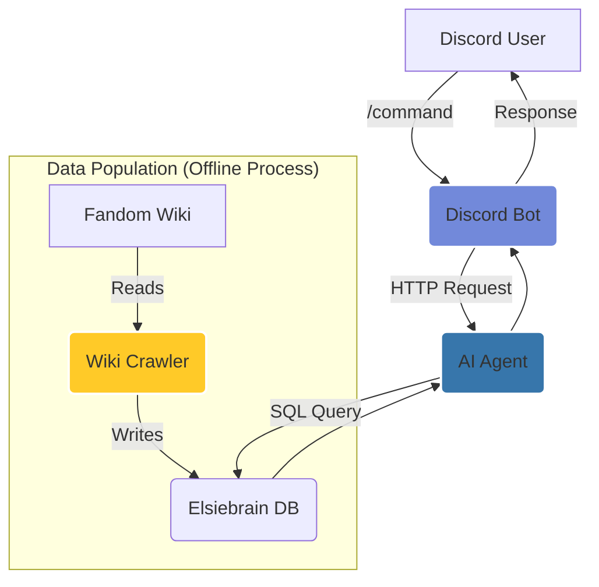

# Elsie: AI-Powered Discord Bot

Elsie is a sophisticated, containerized Discord bot designed for the 22nd Mobile Daedalus Fleet community. She functions as a holographic bartender and stellar cartographer, capable of accessing a comprehensive, self-updating fleet database to provide information on mission logs, ship specifications, personnel files, and more.

The project integrates a Python-based AI agent with a Go-based Discord client, all orchestrated with Docker for seamless development and deployment.

## Architecture

The system is composed of four main services that work together within a Docker network:



1.  **Discord Bot (`discord_bot`)**: A Go application that connects to the Discord gateway, listens for slash commands, and communicates with the AI Agent via an HTTP API.
2.  **AI Agent (`ai_agent`)**: A Python FastAPI server powered by Google's Gemma model. It processes natural language queries, retrieves context from the `elsiebrain` database, and generates in-character responses.
3.  **Elsiebrain DB (`elsiebrain_db`)**: A PostgreSQL database that stores all content crawled from the fleet's Fandom wiki. It is the single source of truth for the AI Agent.
4.  **Wiki Crawler (`db_populator`)**: A standalone Python script responsible for crawling the wiki, classifying pages, and populating or updating the `elsiebrain` database.

## Core Components

### AI Agent (`ai_agent/`)

-   **Backend**: Python with FastAPI.
-   **AI Model**: Google Gemma.
-   **Functionality**:
    -   Serves a `/process` endpoint to receive messages from the Discord bot.
    -   Classifies user intent to determine if the query is about logs, ships, characters, or general information.
    -   Constructs detailed, context-rich prompts for the Gemma model.
    -   Connects to the `elsiebrain_db` for read-only information retrieval using a unified, full-text search capable `search_pages` function.

### Discord Bot (`discord_bot/`)

-   **Language**: Go with the `discordgo` library.
-   **Functionality**:
    -   Manages the bot's presence and interactions on Discord.
    -   Registers and handles slash commands.
    -   Forwards user messages to the AI Agent's API.
    -   Manages conversation history and context for each user session.

### Database Populator (`db_populator/`)

-   **`wiki_crawler.py`**: The primary script for populating the database.
-   **Features**:
    -   **Differential Updates**: Calculates a hash of page content to crawl only pages that have changed, saving time and resources.
    -   **Page Classification**: Automatically determines page types (`mission_log`, `ship_info`, `personnel`, etc.) based on title and content patterns.
    -   **Metadata Tracking**: Logs crawl history, status, and errors for each page.
    -   **Robust Error Handling**: Gracefully handles network issues or errors during crawling.

### Elsiebrain Database

-   **Engine**: PostgreSQL.
-   **Key Tables**:
    -   `wiki_pages`: Stores the content, title, URL, and classified metadata for each wiki page.
    -   `page_metadata`: Tracks crawl status, content hashes, and timestamps for differential updates.
-   **Full-Text Search**: Utilizes `tsvector` and `tsquery` for efficient and intelligent searching across page titles and content.

## Development & Testing

For detailed setup instructions, see `SETUP.md`.

The recommended development environment is **VS Code with the Dev Containers extension**, which automates the setup of the entire stack.

### Running Tests

Individual components can be tested within the Dev Container or locally:

-   **Check Database Stats**:
    ```bash
    python db_populator/wiki_crawler.py --stats
    ```
-   **Test AI Agent Endpoint**:
    ```bash
    # From within the ai_agent container or local venv
    curl -X POST -H "Content-Type: application/json" -d '{"message": "Hello"}' http://localhost:8000/process
    ```
-   **Manual Database Query**:
    Use the `debug_manual_query` function in `ai_agent/content_retrieval_db.py` for direct database search tests.

## Project Structure

```
Elsie/
├── .devcontainer/      # DevContainer configuration for VS Code
├── ai_agent/           # Python-based AI agent system
├── discord_bot/        # Go-based Discord bot implementation
├── aws/               # AWS deployment configurations
├── docs/              # Project documentation
└── .github/           # GitHub Actions workflows
```

## Setup Instructions

### 🚀 Quick Start (DevContainer - Recommended)

1. **Prerequisites:**
   - VS Code with Remote-Containers extension
   - Docker Desktop

2. **Open in DevContainer:**
   ```bash
   git clone [repository-url]
   cd Elsie
   code .
   ```
   - Press `F1` → "Dev Containers: Reopen in Container"
   - Wait for setup to complete

3. **Configure and Start:**
   ```bash
   # Edit .env with your Discord token
   nano .env
   
   # Start all services
   .devcontainer/scripts/start-all.sh
   ```

### 🛠️ Manual Setup

1. Prerequisites:
   - Python 3.9+
   - Go 1.21+
   - Docker
   - AWS Account (for deployment)

2. Development Setup:
   ```bash
   # Clone the repository
   git clone [repository-url]
   cd Elsie

   # Set up Python environment
   cd ai_agent
   python -m venv venv
   source venv/bin/activate  # On Windows: .\venv\Scripts\activate
   pip install -r requirements.txt

   # Set up Go environment
   cd ../discord_bot
   go mod download
   ```

3. Running Locally:
   ```bash
   # Start the AI agent
   cd ai_agent
   python main.py

   # Start the Discord bot
   cd ../discord_bot
   go run main.go
   ```

4. Docker Deployment:
   ```bash
   docker-compose -f docker-compose.local.yml up --build
   ```

## 🚀 Development

For the best development experience, use the DevContainer setup which provides:
- ✅ Complete Go and Python environments
- ✅ Hot reload for both services  
- ✅ Pre-configured VS Code workspace
- ✅ Docker-in-Docker support
- ✅ All development tools ready to go

See `.devcontainer/README.md` for detailed development instructions.

## 🌐 AWS Deployment

The project is configured for AWS free tier deployment using Docker containers. See `aws/` directory for CloudFormation templates and deployment configurations.

## License

MIT License 