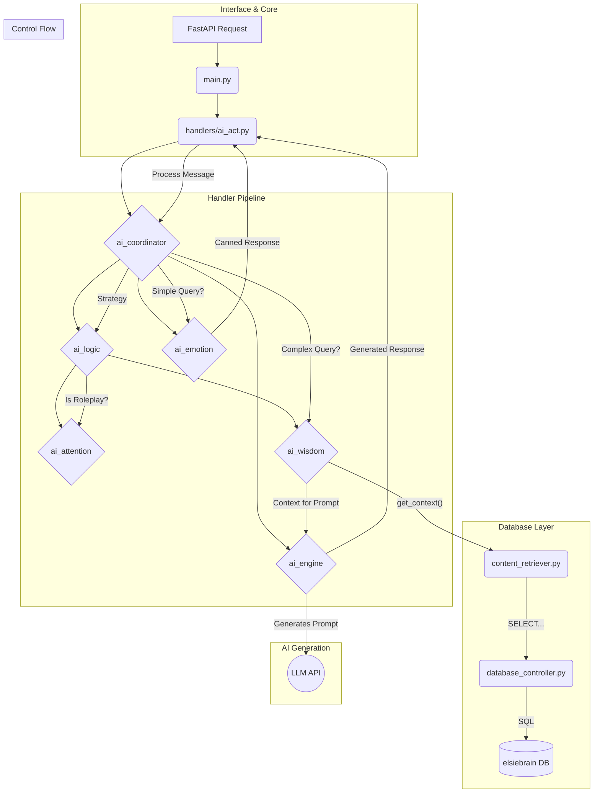

# AI Agent - Python Component

This directory contains the Python-based AI agent for the Elsie project. It is a FastAPI application that serves as the "brain" of the bot, handling all complex logic, natural language processing, and state management.

## Responsibilities

- **API Endpoint**: Provides a `/process` endpoint to receive messages and context from the Discord bot.
- **Strategy Engine**: Determines the best response strategy for a given message (e.g., general chat, roleplay, information query).
- **Roleplay Management**:
    - Detects the start and end of roleplay sessions.
    - Tracks participants, turns, and conversation flow.
    - Manages a "listening mode" to avoid being intrusive in multi-character scenes.
- **DGM (Daedalus Game Master) Handling**:
    - Parses `[DGM]` commands for scene control.
    - Allows DGMs to start scenes, end scenes, and even control Elsie's actions directly.
    - Overrides channel restrictions for DGM posts.
- **State Management**: Maintains the state of roleplay sessions, including active participants, session start time, and more.
- **Response Generation**: Constructs prompts and coordinates with an AI model (like Google's Gemma) to generate intelligent, in-character responses.
- **Database Interaction**: Queries a knowledge base (the `elsiebrain` database) for information about lore, characters, and logs when needed.

## Architecture

The AI agent is built using a modular, handler-based architecture to separate concerns and make the system extensible.

### Core Components

-   **`main.py`**: The main FastAPI application file. It defines the API endpoints (`/process`, `/health`), manages the application lifecycle (startup/shutdown), and handles incoming requests.

-   **`database_controller.py`**: The low-level controller for all database interactions. It manages the connection pool to the `elsiebrain` PostgreSQL database and is responsible for executing all SQL queries.

-   **`content_retriever.py`**: A high-level abstraction layer that sits on top of the `database_controller`. It provides simple, purpose-built functions (e.g., `get_character_context`, `get_log_content`) that the rest of the application can call without needing to know about the underlying database schema.

-   **`log_processor.py`**: A utility module for parsing and cleaning raw log content retrieved from the database.

-   **`config.py`**: Stores all configuration, including API keys, database credentials, and regex patterns used for query detection throughout the application.

-   **`handlers/`**: This directory contains the core intelligence of the AI agent, broken down into the following packages:
    -   **`ai_act` & `ai_coordinator`**: The top-level coordinators that interface with `main.py`, receive requests, and direct them through the processing pipeline. `ai_act.py` specifically handles the interface with the Discord bot's data structures.
    -   **`ai_logic`**: Contains the "inner monologue" of the bot. It uses the `strategy_engine` to determine the high-level response strategy and `query_detection` to identify specific user intents.
    -   **`ai_attention`**: Manages all aspects of roleplay, including state management (`state_manager.py`), DGM command handling, character tracking, and response logic for social situations.
    -   **`ai_wisdom`**: Responsible for gathering and coordinating context from `content_retriever.py` to build rich, informative prompts for the AI. It has a `context_coordinator.py` that routes requests to either a `roleplay_context_builder.py` or a `non_roleplay_context_builder.py`.
    -   **`ai_emotion`**: Contains handlers for pre-generated "canned" responses. This gives Elsie a consistent personality for simple interactions (like greetings or drink orders) without needing to call the full AI model, making the system highly efficient.
    -   **`ai_engine`**: The final step in the "smart" pipeline. This module constructs the final prompt and performs the expensive call to the external AI (Gemma) API.

### Data & Processing Flow

## How it Works

1.  A `POST` request with the message context arrives at **`main.py`**.
2.  The request is passed to **`ai_act.py`** and then to the **`ai_coordinator`**, which begins the main processing pipeline.
3.  The **`ai_logic`** layer determines a `strategy` for the response. It leverages the **`ai_attention`** layer to understand the social context (is it roleplay? who is speaking?).
4.  A crucial decision is made:
    -   **Fast Path (No AI)**: If the strategy is simple (a greeting, a DGM post, a drink order), a pre-generated response is retrieved from the **`ai_emotion`** package and returned immediately.
    -   **Slow Path (AI Needed)**: For complex queries, the **`ai_wisdom`** layer is engaged.
5.  `ai_wisdom` fetches relevant information by calling functions in **`content_retriever.py`**, which in turn uses the **`database_controller`** to query the database.
6.  The retrieved context is passed to the **`ai_engine`**, which builds a final prompt and sends it to the external LLM for generation.
7.  The final response is passed back up the chain and sent out via the API.

This architecture ensures that Elsie's responses are context-aware, intelligent, and efficient, using the "fast path" for simple interactions and reserving expensive AI calls for when they are truly needed. 