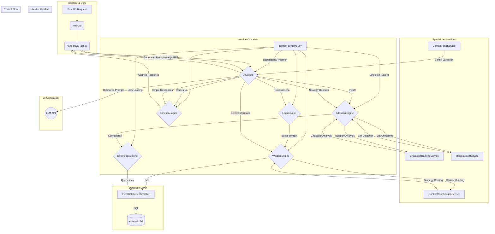

# AI Agent - Python Component

This directory contains the Python-based AI agent for the Elsie project. It is a FastAPI application that serves as the "brain" of the bot, handling all complex logic, natural language processing, and state management using a modern service container architecture.

## Responsibilities

- **API Endpoint**: Provides a `/process` endpoint to receive messages and context from the Discord bot.
- **Service Container**: Manages dependency injection for all services with singleton pattern and lazy loading.
- **Strategy Engine**: Determines the best response strategy for a given message (e.g., general chat, roleplay, information query).
- **Roleplay Management**:
    - Detects the start and end of roleplay sessions.
    - Tracks participants, turns, and conversation flow.
    - Manages a "listening mode" to avoid being intrusive in multi-character scenes.
- **DGM (Daedalus Game Master) Handling**:
    - Parses `[DGM]` commands for scene control.
    - Allows DGMs to start scenes, end scenes, and even control Elsie's actions directly.
    - Overrides channel restrictions for DGM posts.
- **State Management**: Maintains the state of roleplay sessions, including active participants, session start time, and more.
- **Response Generation**: Constructs prompts and coordinates with an AI model (like Google's Gemma) to generate intelligent, in-character responses.
- **Database Interaction**: Queries a knowledge base (the `elsiebrain` database) for information about lore, characters, and logs when needed.

## Architecture

The AI agent is built using a modern **service container architecture** with dependency injection, ensuring clean separation of concerns, testability, and maintainability.

### Core Components

-   **`main.py`**: The main FastAPI application file. It defines the API endpoints (`/process`, `/health`), manages the application lifecycle (startup/shutdown), and handles incoming requests.

-   **`handlers/service_container.py`**: **The heart of the new architecture**. Manages all service instances using dependency injection with singleton pattern. Provides 18+ registered services including engines, controllers, and utilities.

### Service Categories

#### **Core Engines**
- **`AIEngine`**: Coordinates AI response generation with caching and optimization
- **`AttentionEngine`**: LLM-powered roleplay strategy determination
- **`EmotionEngine`**: Personality and emotional response analysis
- **`LogicEngine`**: Response routing and decision-making logic
- **`KnowledgeEngine`**: Database query processing and content retrieval
- **`WisdomEngine`**: Context building and prompt generation

#### **State Management Services**
- **`RoleplayStateManager`**: Tracks roleplay sessions, participants, and conversation flow
- **`FleetDatabaseController`**: Low-level database connection and query execution

#### **Specialized Services**
- **`CharacterTrackingService`**: Character name extraction and validation with Nordic/Icelandic support
- **`RoleplayExitService`**: Roleplay session exit condition detection with OOC support
- **`ContextCoordinationService`**: Routes context building between different strategies
- **`ContextAnalysisService`**: Message context analysis and addressing pattern detection
- **`GreetingService`**: Intelligent greeting detection and response generation
- **`DrinkService`**: Bar service interactions and drink menu management
- **`MockResponseService`**: Canned response management for efficiency
- **`PoeticService`**: Creative and poetic response generation

#### **Utility Services**
- **`TextUtilityService`**: Text processing, formatting, and validation utilities
- **`DateConversionService`**: Earth date to Star Trek stardate conversion
- **`ContentFilterService`**: Content filtering and safety validation

### Service Container Benefits

1. **Dependency Injection**: All services are injected as dependencies, making testing and mocking easy
2. **Singleton Pattern**: Services are instantiated once and reused for performance
3. **Lazy Loading**: Services are created only when first requested
4. **Type Safety**: Full type hints and proper interface contracts
5. **Clean APIs**: Each service provides a focused, well-defined interface
6. **Enhanced Functionality**: Services provide more features than the original standalone functions

### Usage Pattern

```python
# Modern service container usage
from handlers.service_container import (
    register_default_services,
    get_character_tracking_service,
    get_roleplay_state,
    get_ai_engine
)

# Register all services (typically done at startup)
register_default_services()

# Get services through dependency injection
char_service = get_character_tracking_service()
rp_state = get_roleplay_state()
ai_engine = get_ai_engine()

# Use service APIs
characters = char_service.extract_character_names_from_emotes(message)
stats = char_service.get_character_statistics(message)
```

### Handler Packages

-   **`ai_act` & `ai_coordinator`**: Top-level coordinators that interface with `main.py` and orchestrate the service container
-   **`ai_logic`**: Response routing and decision logic using injected services
-   **`ai_attention`**: Roleplay management services and state tracking
-   **`ai_wisdom`**: Context coordination and content retrieval services
-   **`ai_emotion`**: Personality and emotional response services
-   **`utilities`**: Shared utility services for text processing and validation

### Data & Processing Flow



## How it Works

1.  A `POST` request with the message context arrives at **`main.py`**.
2.  The service container is initialized with all 18+ services registered for dependency injection.
3.  The request is passed to **`ai_act.py`** and then to the **`ai_coordinator`**, which uses the service container to access needed services.
4.  The **`LogicEngine`** service determines a `strategy` for the response, leveraging the **`AttentionEngine`** and **`CharacterTrackingService`** to understand social context.
5.  A crucial decision is made:
    -   **Fast Path (No AI)**: Simple interactions use pre-generated responses from **`EmotionEngine`** services (greetings, drinks, acknowledgments) and return immediately.
    -   **Slow Path (AI Needed)**: Complex queries engage the **`WisdomEngine`** and **`KnowledgeEngine`** services.
6.  The **`WisdomEngine`** coordinates with **`ContextCoordinationService`** to fetch relevant information via the **`FleetDatabaseController`** service.
7.  The retrieved context is passed to the **`AIEngine`** service, which builds optimized prompts and manages LLM communication.
8.  All services use dependency injection for clean separation of concerns and enhanced testability.

## Key Improvements

- **🏗️ Service Container Architecture**: Modern dependency injection pattern
- **🔧 18+ Specialized Services**: Each with focused responsibilities and enhanced APIs
- **⚡ Performance Optimized**: Singleton pattern with lazy loading and caching
- **🧪 Highly Testable**: All dependencies can be easily mocked
- **📚 Enhanced Functionality**: Services provide more features than original functions
- **🔒 Type Safe**: Full type hints throughout the service layer
- **🎯 Clean APIs**: Well-defined interfaces for each service
- **🚀 Scalable**: Easy to add new services and extend functionality

This architecture ensures that Elsie's responses are context-aware, intelligent, and efficient, using the "fast path" for simple interactions and reserving expensive AI calls for when they are truly needed, all while maintaining clean, testable, and maintainable code. 