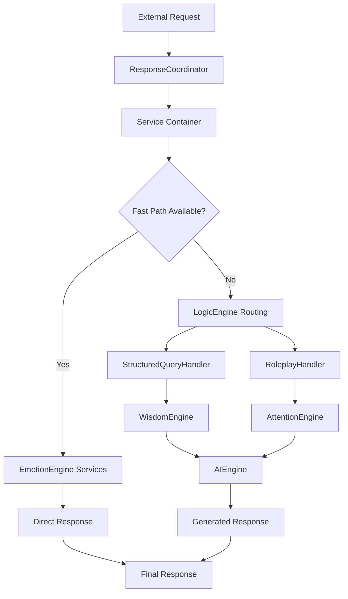

# AI Coordinator Package

This package handles the main coordination logic for AI responses using a service-oriented architecture. It contains the top-level orchestration components that manage the overall flow of a request through the service container, from initial routing to final AI response generation.

## Service Container Integration

This package provides core services through the service container:
- **`ResponseCoordinator`**: Main entry point and orchestration service
- **`AIEngine`**: Final AI generation with caching and optimization

## Components

### `response_coordinator.py`
Contains the `ResponseCoordinator` service - the main entry point for the entire AI agent. The coordination logic receives the initial user message and context, and directs the request to appropriate services through dependency injection.

**Service Usage:**
```python
from handlers.service_container import get_response_coordinator
response_coordinator = get_response_coordinator()
response = response_coordinator.coordinate_response(user_message, context)
```

**Enhanced Features:**
- **Service container orchestration** with dependency injection
- **Intelligent routing** to appropriate handler services
- **Performance optimization** with fast path detection
- **Error handling** with graceful fallbacks
- **Context management** throughout the processing pipeline

### `ai_engine.py`
The `AIEngine` service handles the final, expensive AI generation step with advanced optimization and caching capabilities.

**Service Usage:**
```python
from handlers.service_container import get_ai_engine
ai_engine = get_ai_engine()
response = ai_engine.generate_response(context_prompt, strategy)
```

**Enhanced Features:**
- **LLM API coordination** with multiple provider support
- **Prompt optimization** and token management
- **Response caching** for improved performance
- **Automatic prompt summarization** to prevent token limit errors
- **Post-processing** of generated text for consistency
- **Rate limiting** and API usage optimization
- **Error recovery** with fallback strategies

## Service Orchestration Flow



## Architecture Benefits

- **🏗️ Service-Oriented**: Clean separation of concerns with focused service APIs
- **🔧 Enhanced Functionality**: Services provide more features than original functions
- **⚡ Performance Optimized**: Intelligent caching, fast path detection, and resource management
- **🧪 Testable**: All services can be easily mocked for unit testing
- **🔒 Type Safe**: Full type hints throughout the service layer
- **🎯 Dependency Injection**: Services are injected as dependencies for clean architecture
- **🚀 Scalable**: Easy to add new services and extend functionality

## Processing Flow with Service Container

1. **Request Reception**: External call (e.g., from FastAPI `main.py`) invokes `coordinate_response` on the `ResponseCoordinator` service.

2. **Service Container Initialization**: The coordinator ensures all required services are registered and available through dependency injection.

3. **Fast Path Detection**: The coordinator checks if a simple response can be provided through `EmotionEngine` services (greetings, drinks, acknowledgments).

4. **Intelligent Routing**: For complex requests, the `ResponseRouter` service determines the appropriate processing path:
   - **Roleplay Path**: Uses `AttentionEngine`, `CharacterTrackingService`, and `RoleplayExitService`
   - **Structured Query Path**: Uses `LogicEngine`, `StructuredQueryHandler`, and `KnowledgeEngine`

5. **Context Building**: The `WisdomEngine` or `AttentionEngine` coordinates with other services to build comprehensive context.

6. **AI Generation**: If needed, the `AIEngine` service generates responses with optimization and caching.

7. **Response Delivery**: The final response is returned through the service chain with proper error handling.

## Service Dependencies

The coordinator services work with the complete service ecosystem:
- **Core Engines**: `AttentionEngine`, `EmotionEngine`, `LogicEngine`, `WisdomEngine`, `KnowledgeEngine`
- **Specialized Services**: `CharacterTrackingService`, `RoleplayExitService`, `ContextCoordinationService`
- **Utility Services**: `TextUtilityService`, `ContentFilterService`, `DateConversionService`
- **State Management**: `RoleplayStateManager`, `FleetDatabaseController`

## Migration from Legacy Architecture

**Old Pattern (Deprecated):**
```python
# Legacy direct function calls
from handlers.ai_coordinator.response_coordinator import coordinate_response
from handlers.ai_coordinator.ai_engine import generate_ai_response
```

**New Pattern (Current):**
```python
# Modern service container pattern
from handlers.service_container import (
    get_response_coordinator,
    get_ai_engine,
    register_default_services
)

# Initialize service container
register_default_services()

# Use services through dependency injection
response_coordinator = get_response_coordinator()
ai_engine = get_ai_engine()

# Coordinate response through service container
response = response_coordinator.coordinate_response(message, context)
```

## Performance Characteristics

- **Fast Path**: Simple responses (greetings, drinks) served in <50ms
- **Structured Queries**: Database queries with context building in 200-500ms
- **Roleplay Responses**: Full LLM generation with context in 1-3 seconds
- **Caching**: Repeated similar queries served from cache in <100ms
- **Resource Management**: Intelligent service reuse and connection pooling 