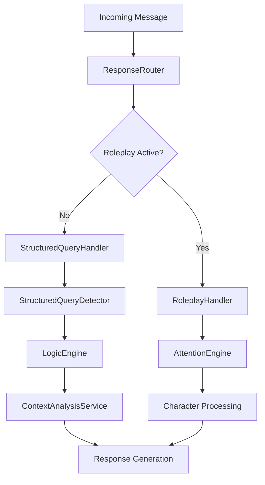

# AI Logic Package

This package serves as the "central nervous system" of the agent's decision-making process using a service-oriented architecture. It handles message routing, query analysis, and structured request processing through specialized services.

## Service Container Integration

This package provides several services through the service container:
- **`LogicEngine`**: LLM-powered reasoning and database category determination
- **`StructuredQueryDetector`**: Pattern-based query classification and analysis
- **`StructuredQueryHandler`**: Orchestrates the complete structured query flow
- **`ResponseDecision`**: High-level response strategy determination
- **`ResponseRouter`**: Message routing between roleplay and structured query systems
- **`RoleplayHandler`**: Specialized roleplay message processing
- **`ContextAnalysisService`**: Message context analysis and addressing detection

## Core Components

### `response_router.py`
Contains the `ResponseRouter` service - the first point of contact after the `ResponseCoordinator`. The routing logic inspects the `RoleplayStateManager` and makes the primary decision: should this message be handled by the roleplay system or the structured query system?

**Service Usage:**
```python
from handlers.service_container import get_response_router
response_router = get_response_router()
route_decision = response_router.route_message_to_handler(message, context)
```

**Enhanced Features:**
- **Intelligent routing** between roleplay and structured query systems
- **Context-aware decisions** based on current roleplay state
- **Priority handling** for DGM commands and special cases
- **Fallback mechanisms** for edge cases

### `structured_query_detector.py`
The `StructuredQueryDetector` service uses advanced pattern matching and classification to analyze user messages and determine query types.

**Service Usage:**
```python
# Typically used through StructuredQueryHandler
detector = StructuredQueryDetector()
query_info = detector.detect_query_type(user_message)
```

**Enhanced Features:**
- **Multi-pattern analysis** using regular expressions and heuristics
- **Query classification** into specific types (search, logs, general inquiry)
- **Parameter extraction** from user messages
- **Confidence scoring** for query type determination

### `structured_query_handler.py`
The `StructuredQueryHandler` service orchestrates the complete flow for standard queries, coordinating multiple services.

**Service Usage:**
```python
# Typically used through response routing
handler = StructuredQueryHandler()
response = handler.handle_structured_query(message, context)
```

**Coordination Flow:**
1. Uses `StructuredQueryDetector` to classify the message
2. Employs `StructuredContentRetriever` to fetch relevant data
3. Leverages `WisdomEngine` to build final context for AI
4. Coordinates with `LogicEngine` for reasoning tasks

### `logic_engine.py`
The `LogicEngine` service is a specialized LLM component for fine-grained reasoning tasks and database category determination.

**Service Usage:**
```python
from handlers.service_container import get_logic_engine
logic_engine = get_logic_engine()
category = logic_engine.determine_database_category(user_query)
```

**Enhanced Features:**
- **Database category determination** for efficient queries
- **Reasoning assistance** for complex logical operations
- **Query optimization** suggestions
- **Context-aware analysis** for better accuracy

### `context_analysis_service.py`
The `ContextAnalysisService` provides comprehensive message context analysis including character addressing and conversation flow detection.

**Service Usage:**
```python
from handlers.service_container import get_context_analysis_service
context_service = get_context_analysis_service()
analysis = context_service.analyze_message_context(message, history)
```

**Enhanced Features:**
- **Character addressing detection** using `CharacterTrackingService`
- **Conversation flow analysis** for appropriate response timing
- **Context relevance scoring** for message importance
- **Multi-character conversation handling**

### `response_decision.py`
Contains high-level response strategy determination logic, coordinating with multiple services to make optimal decisions.

**Features:**
- **Strategy selection** based on message analysis
- **Priority determination** for different response types
- **Resource allocation** decisions (fast path vs. LLM usage)
- **Context-aware routing** to appropriate handlers

### `roleplay_handler.py`
Specialized handler for roleplay-specific message processing, working closely with attention services.

**Features:**
- **Roleplay message analysis** and processing
- **Character interaction handling**
- **Scene management** coordination
- **Immersion maintenance** logic

## Architecture Benefits

- **🏗️ Service-Oriented**: Clean separation of concerns with focused service APIs
- **🔧 Enhanced Functionality**: Services provide more features than original functions
- **⚡ Performance Optimized**: Efficient routing and selective LLM usage
- **🧪 Testable**: All services can be easily mocked for unit testing
- **🔒 Type Safe**: Full type hints throughout the service layer
- **🎯 Dependency Injection**: Services are injected as dependencies for clean architecture
- **🧠 Intelligent Routing**: Smart decision-making for optimal response strategies

## Service Dependencies

The logic services coordinate with other service container components:
- **`RoleplayStateManager`**: For roleplay session state checking
- **`CharacterTrackingService`**: For character name extraction and addressing
- **`AttentionEngine`**: For roleplay strategy determination
- **`WisdomEngine`**: For context building and prompt generation
- **`KnowledgeEngine`**: For database query processing
- **`EmotionEngine`**: For emotional context analysis

## Message Processing Flow



## Migration from Legacy Functions

**Old Pattern (Deprecated):**
```python
# Legacy standalone functions (removed)
from handlers.ai_logic.context_detection import analyze_context
from handlers.ai_logic.response_routing import route_message
```

**New Pattern (Current):**
```python
# Modern service container pattern
from handlers.service_container import (
    get_logic_engine,
    get_response_router,
    get_context_analysis_service
)

logic_engine = get_logic_engine()
response_router = get_response_router()
context_service = get_context_analysis_service()
``` 