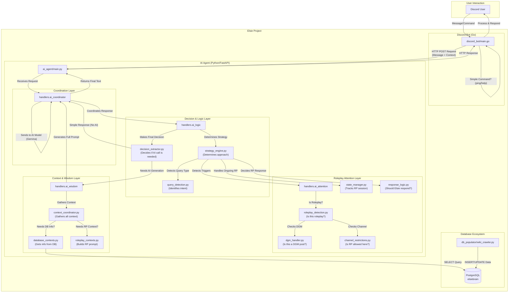

# Elsie System Architecture

This document provides a detailed overview of the technical architecture of the Elsie project. For a simpler, high-level overview, please see the main [README.md](../README.md).

## Architecture Diagram

The following diagram illustrates the flow of a message through the entire system, from the user's input in Discord to the final response. It shows the major components, their interactions, and where key decisions are made.

## Component Breakdown

### 1. User Interaction
- **Discord User**: The end-user who interacts with Elsie by sending messages in a Discord server.

### 2. Discord Bot (Go)
- **`discord_bot/main.go`**: The single-entry point for the Go application.
- **Responsibilities**:
    - Connects to the Discord Gateway.
    - Listens for message events.
    - Handles very simple, hard-coded commands (`!elsie ping`).
    - Packages the message content, user information, and channel context into a JSON payload.
    - Sends an HTTP POST request to the AI Agent and waits for a response.
    - Posts the final response back to the Discord channel, handling message splitting if necessary.

### 3. AI Agent (Python/FastAPI)
This is the core of the system, where all the intelligence resides.

- **`ai_agent/main.py`**: The FastAPI server that exposes the `/process` endpoint.

- **Coordination Layer (`handlers.ai_coordinator`)**:
    - Acts as the central hub for processing a request. It directs the flow of data through the other layers.

- **Decision & Logic Layer (`handlers.ai_logic`)**:
    - **`strategy_engine.py`**: The "inner monologue" of the bot. It performs the first major analysis of the user's message to determine the overall *approach* (e.g., this is a roleplay message, a database query, or just small talk).
    - **`query_detection.py`**: A set of specific functions, mostly using regular expressions, to identify fine-grained user intents, such as asking for a log or information about a character.
    - **`decision_extractor.py`**: A critical optimization component. After the strategy is determined, this module decides if a full, expensive call to an AI model is necessary. For simple actions (like acknowledging a DGM post or listening in a scene), it provides a pre-generated response, saving time and resources.

- **Roleplay Attention Layer (`handlers.ai_attention`)**:
    - This layer manages all aspects of roleplay.
    - **`roleplay_detection.py`**: Detects the presence of roleplay triggers (emotes, dialogue) and calculates a confidence score.
    - **`dgm_handler.py`**: Parses and handles `[DGM]` commands, which have the highest priority.
    - **`state_manager.py`**: A state machine that tracks the current status of a roleplay session (e.g., who is participating, how long the session has been active).
    - **`response_logic.py`**: Once in a roleplay session, this module determines *if* and *how* Elsie should respond. It's responsible for making her a passive listener in multi-character scenes or an active participant when addressed directly.
    - **`channel_restrictions.py`**: Checks if roleplay is allowed in the current channel, but can be overridden by a DGM command.

- **Context & Wisdom Layer (`handlers.ai_wisdom`)**:
    - This layer is responsible for gathering all the necessary information to build a high-quality prompt for the AI model.
    - **`context_coordinator.py`**: The main entry point that assembles the final context.
    - **`database_contexts.py`**: Fetches and formats information from the `elsiebrain` PostgreSQL database if the strategy requires it.
    - **`roleplay_contexts.py`**: Constructs the specialized prompts needed for Elsie to respond naturally and in-character during roleplay.

### 4. Database Ecosystem
- **PostgreSQL (`elsiebrain`)**: The knowledge base of the bot, containing structured data about the game world.
- **`db_populator/wiki_crawler.py`**: An external script used to populate the database from a wiki or other data source. This is not part of the live application but is a critical tool for maintaining the bot's knowledge. 