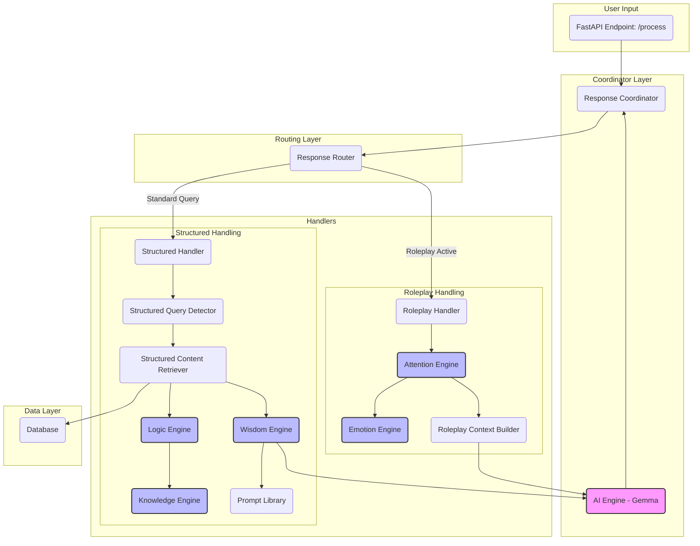

# Elsie Agent - Engine-Driven Architecture

This document outlines the refactored, engine-driven architecture for the Elsie AI agent. The new design emphasizes a modular, decoupled approach where specialized "engines" handle specific domains of logic (e.g., attention, emotion, knowledge), orchestrated by lightweight coordinators.

## Architecture Diagram

## Core Principles

1.  **Separation of Concerns**: Each package and module has a clearly defined responsibility.
2.  **Engine-Based Logic**: Complex, heuristic-based logic is replaced by dedicated, LLM-powered engines.
3.  **Lightweight Orchestration**: Handlers and coordinators are responsible for routing data between engines, not for implementing complex business logic themselves.
4.  **Centralized Data Access**: All database interactions are routed through the `ai_knowledge` package.
5.  **Decoupled Prompting**: Prompt construction is separated from data retrieval and logic, managed by the `ai_wisdom` package.

## Data Flow

### 1. Request Ingestion

-   A user message is received by the `main.py` FastAPI application at the `/process` endpoint.
-   The message, conversation history, and channel context are passed to the `Response Coordinator`.

### 2. Routing

-   The `Response Coordinator` passes the request to the `Response Router` (`ai_logic.response_router`).
-   The router checks the `RoleplayStateManager` to determine if a roleplay session is active.
    -   If **yes**, the request is sent to the `Roleplay Handler`.
    -   If **no**, the request is sent to the `Structured Query Handler`.

### 3. Roleplay Handling Flow

-   **`Roleplay Handler`**: A lightweight orchestrator.
-   **`Attention Engine`**: The "Roleplay Director." This powerful LLM-based engine analyzes the user message, conversation history, and emotional context (provided by the `Emotion Engine`) to determine the optimal response *strategy*. It decides *if* Elsie should respond and *how* (e.g., active dialogue, subtle action, emotional support).
-   **`Roleplay Context Builder`**: Receives the strategy from the `AttentionEngine`. It builds the final, comprehensive prompt for the LLM, incorporating character knowledge, scene details, and the specific strategic guidance.
-   **`AI Engine`**: Receives the final prompt and generates the AI response using the configured Gemma model. The response is then returned to the coordinator.

### 4. Structured Query Flow

-   **`Structured Query Handler`**: The orchestrator for all non-roleplay messages.
-   **`Structured Query Detector`**: Uses regex and pattern matching to classify the user's query (e.g., `explicit_search`, `logs_search`, `general_knowledge`).
-   **`Structured Content Retriever`**: Fetches data from the database based on the query type.
    -   For `general` queries, it consults the `Logic Engine`.
-   **`Logic Engine`**: A utility LLM that performs reasoning tasks, such as determining the correct database category for a general user query. It can consult the `Knowledge Engine` for post-processing large query results if needed.
-   **`Wisdom Engine`**: Receives the retrieved data and the query strategy. It uses the `Prompt Library` to construct a precise, task-specific prompt for the main LLM.
-   **`AI Engine`**: Receives the final prompt from the `Wisdom Engine` and generates the definitive answer for the user.

## Key Modules & Engines

-   **`ai_coordinator`**: Top-level orchestration. Home of the `AIEngine` which makes the final LLM call.
-   **`ai_logic`**: Handles routing and logical decisions. Home of the `LogicEngine` and `StructuredQueryDetector`.
-   **`ai_attention`**: Manages conversational state (`RoleplayStateManager`) and high-level roleplay strategy (`AttentionEngine`).
-   **`ai_emotion`**: Provides emotional analysis (`EmotionEngine`) and generates mock/canned responses.
-   **`ai_wisdom`**: Responsible for building context and prompts. Home of the `WisdomEngine`, `RoleplayContextBuilder`, and `PromptLibrary`.
-   **`ai_knowledge`**: Manages all data persistence. Home of the `DatabaseController` and the `KnowledgeEngine` (for LLM-based data processing). 