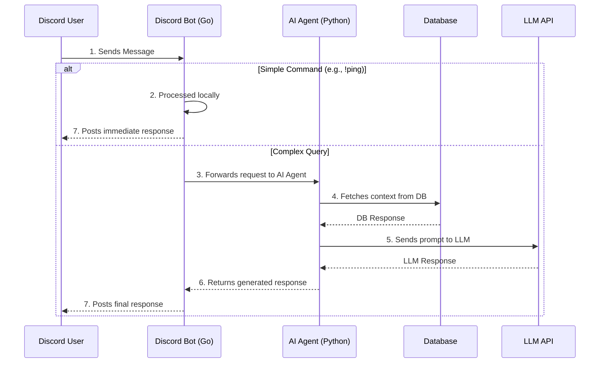
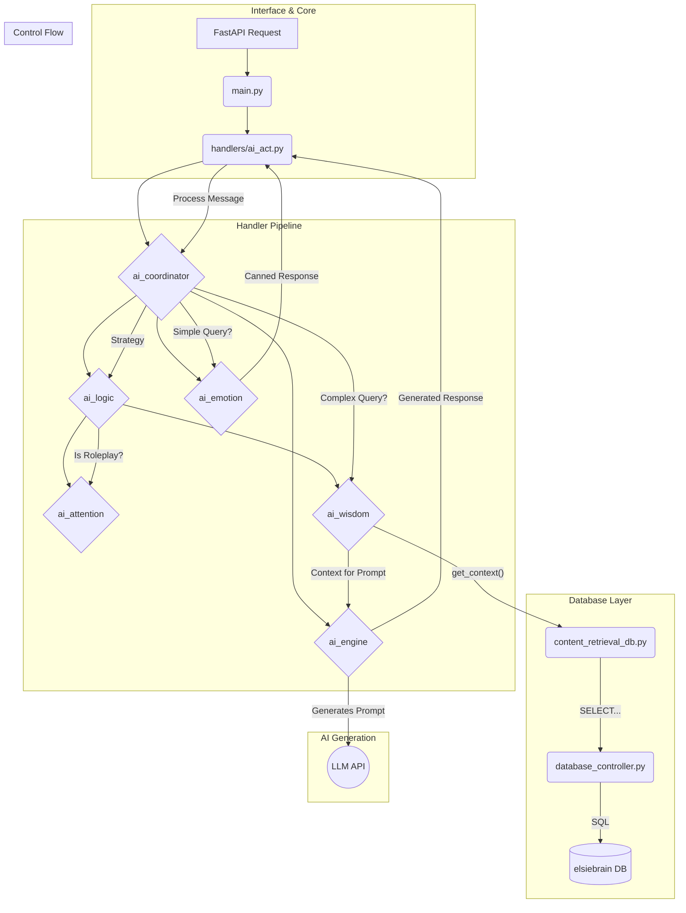

# Elsie System Architecture

This document provides a detailed overview of the technical architecture of the Elsie project.

## High-Level System Flow

The following diagram illustrates the flow of a message through the entire system, from the user's input in Discord to the final response. It shows the major components and their interactions.

## Component Breakdown

### Discord Bot (Go)

-   **Location**: `discord_bot/`
-   **Technology**: Go, `discordgo` library.
-   **Responsibilities**:
    -   Connects to the Discord Gateway and maintains a persistent WebSocket connection.
    -   Listens for and handles Discord events, primarily `messageCreate`.
    -   Handles simple, hard-coded commands like `!elsie ping` for quick, local responses.
    -   Packages complex messages and context (user info, channel info) into a JSON payload.
    -   Forwards the payload to the AI Agent via an HTTP POST request.
    -   Receives the generated response from the AI agent and posts it back to Discord, handling message splitting for long responses.
-   **Key Principle**: This component is designed to be a lightweight and robust Discord client. All complex logic is delegated to the AI Agent to keep this part simple and focused.

### AI Agent (Python/FastAPI)

This is the core "brain" of the system, where all intelligence resides. See the detailed architecture breakdown below for more information.

-   **Location**: `ai_agent/`
-   **Technology**: Python, FastAPI, Google Gemma.
-   **Responsibilities**:
    -   Provides an HTTP API (`/process`) to receive requests from the Go bot.
    -   Analyzes user messages to determine intent and strategy.
    -   Manages roleplay state, including participants, turns, and DGM commands.
    -   Queries the database for contextual information (lore, character bios, logs).
    -   Constructs detailed prompts and calls an external Large Language Model (LLM) for response generation.
    -   Provides efficient, pre-generated responses for simple interactions to avoid unnecessary LLM calls.

### Database (PostgreSQL)

-   **Name**: `elsiebrain`
-   **Responsibilities**: Acts as the long-term memory and knowledge base for the AI Agent. It stores structured data on:
    -   Mission logs and events.
    -   Character biographies.
    -   Ship information.
    -   General lore and world-building articles.

### Supporting functions
- **`db_populator/wiki_crawler.py`**: An external script used to populate the database from a wiki or other data source. This is not part of the live application but is a critical tool for maintaining the bot's knowledge. 

---

## Detailed AI Agent Architecture

This section provides a more detailed breakdown of the internal architecture of the AI Agent component.

### Core Components

-   **`main.py`**: The main FastAPI application file. It defines the API endpoints (`/process`, `/health`), manages the application lifecycle (startup/shutdown), and handles incoming requests.
-   **`database_controller.py`**: The low-level controller for database interactions. It manages the connection pool to the `elsiebrain` PostgreSQL database and executes raw SQL queries.
-   **`content_retrieval_db.py`**: A high-level abstraction layer that provides simple, purpose-built functions (e.g., `get_character_context`) that the rest of the application can use.
-   **`handlers/`**: This directory contains the core intelligence of the AI agent:
    -   **`ai_act` & `ai_coordinator`**: The top-level coordinators that interface with `main.py` and direct requests through the processing pipeline.
    -   **`ai_logic`**: Contains the "inner monologue" of the bot, determining response strategy and detecting user intent.
    -   **`ai_attention`**: Manages all aspects of roleplay state, DGM commands, and social interaction rules.
    -   **`ai_wisdom`**: Gathers and coordinates context from the database to build rich prompts.
    -   **`ai_emotion`**: Provides pre-generated, "canned" responses for simple interactions, allowing for a highly efficient "fast path".
    -   **`ai_engine`**: Constructs the final prompt and performs the expensive call to the external LLM API.

### AI Agent Data & Processing Flow

### How the AI Agent Works

1.  A `POST` request with the message context arrives at **`main.py`**.
2.  The request is passed to **`ai_act.py`** and then to the **`ai_coordinator`**.
3.  The **`ai_logic`** layer determines a `strategy` for the response, using the **`ai_attention`** layer to understand the social context.
4.  A crucial decision is made:
    -   **Fast Path (No AI)**: For simple strategies, a pre-generated response is retrieved from the **`ai_emotion`** package and returned immediately.
    -   **Slow Path (AI Needed)**: For complex queries, the **`ai_wisdom`** layer is engaged to fetch context from the database.
5.  The retrieved context is passed to the **`ai_engine`**, which builds a prompt and sends it to the external LLM.
6.  The final response is passed back up the chain and sent out via the API.
