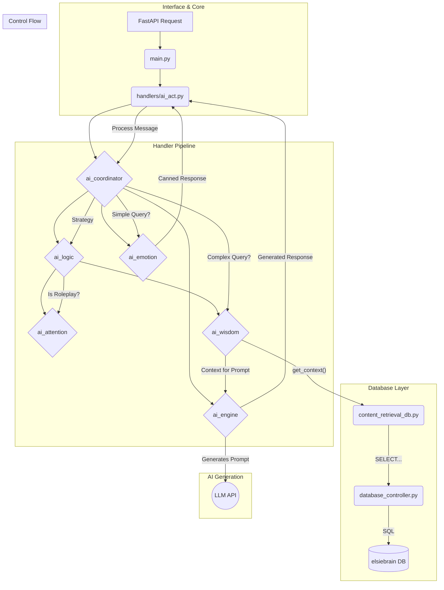

# Elsie System Architecture

This document provides a detailed overview of the technical architecture of the Elsie project. For a simpler, high-level overview, please see the main [README.md](../README.md).

## High-Level Overview

The Elsie system consists of three main parts:
1.  **Discord Bot (Go)**: A lightweight Go application that connects to the Discord Gateway, listens for messages, and handles basic command parsing.
2.  **AI Agent (Python/FastAPI)**: The "brain" of the system. It receives complex queries from the Go bot via an HTTP API and performs all the natural language processing, state management, and response generation.
3.  **Database (PostgreSQL)**: The knowledge base (`elsiebrain`) that stores lore, logs, and character information.

## Component Breakdown

### 1. User Interaction
- **Discord User**: The end-user who interacts with Elsie by sending messages in a Discord server.

### 2. Discord Bot (Go)
- **`discord_bot/main.go`**: The single-entry point for the Go application.
- **Responsibilities**:
    - Connects to the Discord Gateway.
    - Listens for message events.
    - Handles very simple, hard-coded commands (`!elsie ping`).
    - Packages the message content, user information, and channel context into a JSON payload.
    - Sends an HTTP POST request to the AI Agent and waits for a response.
    - Posts the final response back to the Discord channel, handling message splitting if necessary.

### 3. AI Agent (Python/FastAPI)

This section details the architecture of the Python-based AI agent.

#### Core Components

-   **`main.py`**: The main FastAPI application file. It defines the API endpoints (`/process`, `/health`), manages the application lifecycle (startup/shutdown), and handles incoming requests.

-   **`database_controller.py`**: The low-level controller for database interactions. It manages the connection pool to the `elsiebrain` PostgreSQL database and executes raw SQL queries.

-   **`content_retrieval_db.py`**: A high-level abstraction layer that sits on top of the `database_controller`. It provides simple, purpose-built functions (e.g., `get_character_context`, `get_log_content`) that the rest of the application can use without needing to know the database schema.

-   **`log_processor.py`**: A utility module for parsing and cleaning raw log content retrieved from the database.

-   **`config.py`**: Stores all configuration, including API keys, database credentials, and regex patterns used for query detection throughout the application.

-   **`handlers/`**: This directory contains the core intelligence of the AI agent, broken down into the following packages:
    -   **`ai_act` & `ai_coordinator`**: The top-level coordinators that interface with `main.py`, receive requests, and direct them through the processing pipeline. `ai_act.py` specifically handles the interface with the Discord bot's data structures.
    -   **`ai_logic`**: Contains the "inner monologue" of the bot. It uses the `strategy_engine` to determine the high-level response strategy and `query_detection` to identify specific user intents.
    -   **`ai_attention`**: Manages all aspects of roleplay, including state management (`state_manager.py`), DGM command handling, character tracking, and response logic for social situations.
    -   **`ai_wisdom`**: Responsible for gathering and coordinating context from `content_retrieval_db.py` to build rich, informative prompts for the AI.
    -   **`ai_emotion`**: Contains handlers for pre-generated "canned" responses. This gives Elsie a consistent personality for simple interactions (like greetings or drink orders) without needing to call the full AI model, making the system highly efficient.
    -   **`ai_engine`**: The final step in the "smart" pipeline. This module constructs the final prompt and performs the expensive call to the external AI (Gemma) API.

#### Data & Processing Flow

#### How it Works

1.  A `POST` request with the message context arrives at **`main.py`**.
2.  The request is passed to **`ai_act.py`** and then to the **`ai_coordinator`**, which begins the main processing pipeline.
3.  The **`ai_logic`** layer determines a `strategy` for the response. It leverages the **`ai_attention`** layer to understand the social context (is it roleplay? who is speaking?).
4.  A crucial decision is made:
    -   **Fast Path (No AI)**: If the strategy is simple (a greeting, a DGM post, a drink order), a pre-generated response is retrieved from the **`ai_emotion`** package and returned immediately.
    -   **Slow Path (AI Needed)**: For complex queries, the **`ai_wisdom`** layer is engaged.
5.  `ai_wisdom` fetches relevant information by calling functions in **`content_retrieval_db.py`**, which in turn uses the **`database_controller`** to query the database.
6.  The retrieved context is passed to the **`ai_engine`**, which builds a final prompt and sends it to the external LLM for generation.
7.  The final response is passed back up the chain and sent out via the API.

### 4. Database Ecosystem
- **PostgreSQL (`elsiebrain`)**: The knowledge base of the bot, containing structured data about the game world.
- **`db_populator/wiki_crawler.py`**: An external script used to populate the database from a wiki or other data source. This is not part of the live application but is a critical tool for maintaining the bot's knowledge. 